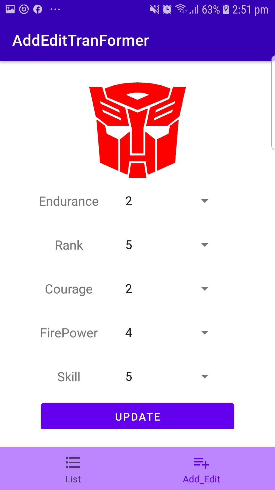
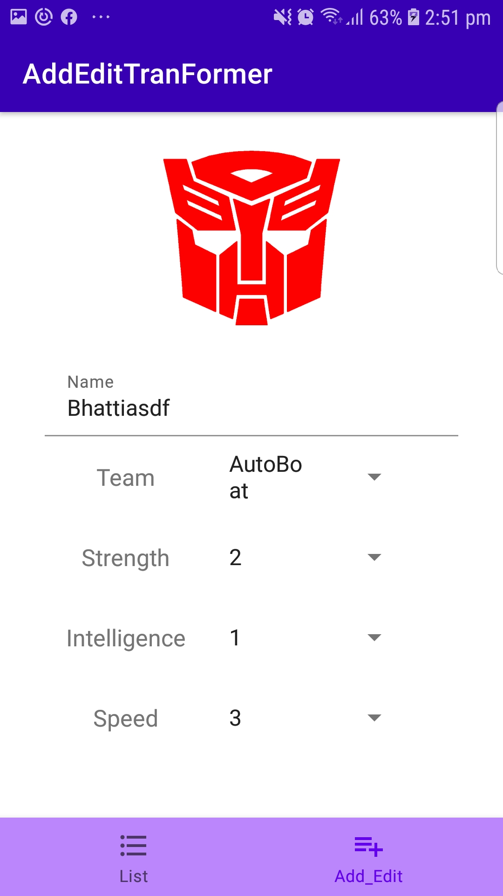
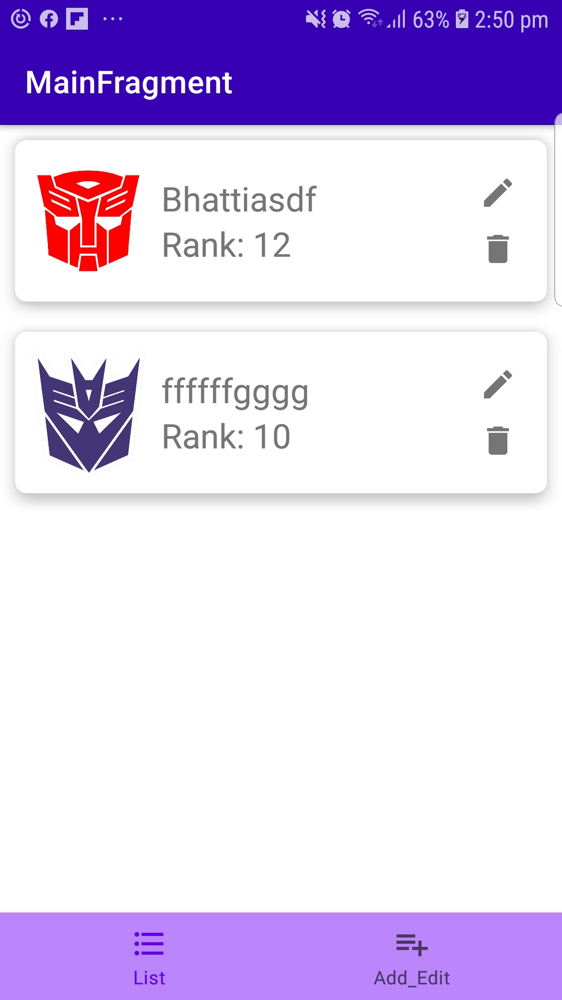
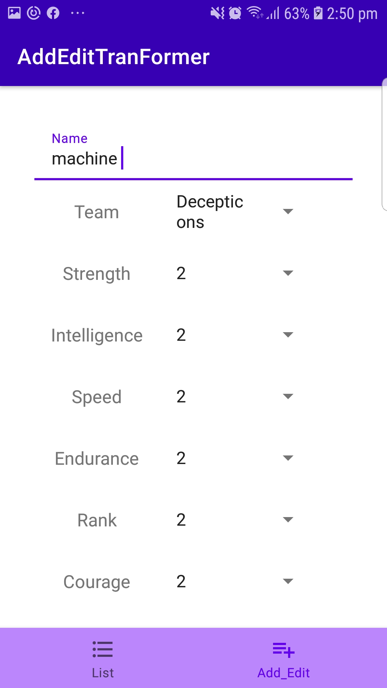

# Android TranFormer Api MVVM with Jetpack
## major components
* Hilt
* Jetpack navigation
* Safe Args
* Retrofit
* Repository Pattern
* Clean Architecture
* SOLID Principles
* Data Store
* Picasso
* SSp Sdp
* Room DataBase
* Gson
## Screenshot

SS1|SS2|SS3
:--:|:--:|:--:|
||

App SS4|
:--:|
|

##Api Implemented 
* [Transformer Api](https://transformers-api.firebaseapp.com/api-docs/)
## Get Bearer Token perform GET PUT POST DELETE Ops on Transformer
